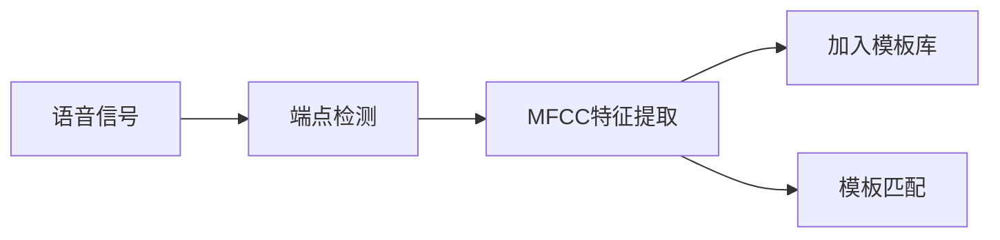

# 基于DTW的数字语音识别实验报告

## 刘志成 李家正 冯旭 栾政轩 曲劭儒

---

本实验代码已经上传至github仓库
https://github.com/zchliu/2020-fall/tree/master/DSP/homework3/DTW

本实验算法思想与部分代码参考自教材《语音信号处理实验教程-——梁瑞宇》

### 一、实验目的

1. 掌握语音识别的模板匹配法的原理和过程
2. 掌握动态时间规整（DTW）技术
3. 应用MATLAB实现基于DTW的10个阿拉伯数字的语音识别，各个功能模块均应采用编程
来实现，包含必要的界面，能够自动地完成语音识别的完整过程。

### 二、计算模型

DTW是基于模板匹配法的孤立词语音识别技术，该算法基于动态规划（DP）的思想，解决了发音长短不一的模板匹配问题，是语音识别中出现较早、较为经典的一种算法，由于是使用模板匹配的思想，DTW算法的训练中几乎不需要额外的计算。在训练阶段，用户将词汇表中的每一个词一次说一遍，并且将其矢量特征时间序列作为模板存入模板库；在识别阶段，将输入语音的特征矢量时间序列依次与模板中的每一个模板进行相似度比较，将相似度最高者作为识别结果输出。

算法主要分成两个部分，其一为模板库的构建，其二为模板匹配。在这之前需要首先提取语音信号的特征，要使用基于短时过零率和短时平均幅度的端点检测技术，和MFCC特征提取技术，然后在构建模板库的时候模板库将其特征存入模板矩阵，在模板匹配的时候将待检测的语音信号与模板库里面的模板注意配对，找到最相似的模板。

在介绍具体的算法之前，首先对数据进行说明。本实验使用MATLAB库函数audiorecord进行采样，所采集到的语音数据的采样率为16000，采样时长为2秒，一共采样3组数据，每组包括0-9这十个阿拉伯数字的语音，得到共30条语音数据，用audiowrite函数保存为.wav格式。

##### 端点检测

端点检测需要首先对语音信号进行分帧处理，这里需要确定帧长和帧移。在本实验中，由于使用的采样率为16000，采样时长为2秒，因此帧长和帧移设定为0.01秒和0.005秒。

然后计算其短时过零率和短时平均幅度，计算公式如下：

短时平均幅度：

$$M_n = \sum_{m=0}^{N-1}|x_n(m)|$$

短时过零率：

$$Z_n = {1 \over 2}\sum_{m=0}^{N-1}|sgn[x_n(m)]-sgn[x_n(m-1)]|$$

然后选取一段声音信号作为环境噪声，这里根据经验值选择初始静默时间为0-0.1秒，并利用其静默信号的平均幅度均值，和最大值计算能量阈值的上下限。

$$\begin{array}{cc} I_{mean} = {1 \over N_{silent}}\sum_{n=0}^{N_{silent}-1}|M_n| \\ I_{max} = \max_{n=0,1,...,N_{silent}-1}|M_n| \\ I_1 = 0.03*(I_{max} - I_{mean}) + I_{mean} \\ I_2 = 4 * I_{mean} \\ I_L = 100 * \min\{I_1,I_2\} \\ I_U = 10 * I_L \end{array}$$

式中$n$表示第$n$帧，$m$表示在这一帧当中的第$m$个信号值，$I_L,I_U$即双门限法的能量阈值。

过零率阈值使用静默信号的平均值和方差来计算。

$$\begin{array}{cc} Z_{mean} = {1 \over N_{silent}}\sum_{m=0}^{N_{silent}-1}|Z_n| \\ Z_{std} = {1 \over N_{silent}}\sum_{n=0}^{N_{silent}-1}(Z_n - Z_{mean})^2 \\ Z_{gate} = \min\{40,Z_{mean}+2*Z_{std}\} \end{array}$$

$Z_{gate}$即为短时过零率的阈值，40为经验值。

双门限法检测：首先从左到右搜寻第一个超过能量上限的帧，记作$r$，然后从当前帧开始向前搜索第一个小于能量下限的帧，记作$l$，我们认为起始帧位于区间$[l,r]$内，然后再在区间$[l,r]$中从左向右搜索第一个超过短时过零率阈值的帧，即可得到真正的起始帧。用同样的思想可以得到一个语音信号的终止帧。

端点检测的效果图如下：

##### MFCC特征提取

MFCCs是一个在语音识别和说话者识别领域被广泛运用的特征，由Davis和Mermelstein在1980年提出，具体的计算过程如下：

1. 对上述端点检测后的信号进行加窗，本实验采用汉明窗

$$w(n) = 0.54-0.46cos({2\pi(n-1) \over N-1})$$

2. 对每一帧信号$i$进行FFT变换，并计算谱线能量

$$\begin{array}{cc}X(i,k) = FFT[x_i(n)] \\ E(i,k) = (X_i(k))^2 \end{array}$$

3. 计算梅尔滤波器能量

$$S(i,m) = \sum_{k=0}^{N-1}E(i,k)H_m(k)$$

4. 计算DCT系数

$$dctcoef(k,m) = cos({(2m+1)k\pi \over 2M})$$

5. 计算MFCC系数

$$mfcc(i,n) = \sqrt{2 \over M}\sum_{m=0}^{M-1}log(S(i,m))dctcoef(k,m)$$

6. 差分

$$d = {1 \over 10}\sum_{n=1}^2n*(f_{t+n} - f_{t-n}) $$

二阶差分就是在一阶差分的基础上再做一次一阶差分

计算得到的MFCC以及一阶差分、二阶差分如下图所示：

在构建模板库的时候，将得到的MFCC、一阶差分、二阶差分合并成为一个大矩阵作为特征加入模板库中，在模板匹配的时候将待检测的语音信号与模板中的语音信号进行匹配。

$$feature = [MFCC,d1,d2]$$

##### DTW算法

在模式匹配阶段中，不能简单地将输入模板和词库中的模板相比较来实现识别。因为语音信号有较强的随机性，更重要的是语音的持续时间不可能完全相同，所以时间规整是必不可少的，DTW是把时间规整和距离测度计算结合起来的非线性规整技术，是模板匹配的方法。

假设词库中某一参考模板的特征矢量是$a_1,...,a_m,...,a_M$，输入语音的特征矢量序列为$b_1,...,b_n,...b_N$，$M \not ={N}$，那么动态时间规整函数$m = T(n)$，它把输入模板的时间轴$n$非线性的映射到参考模板的时间轴$m$，并且该函数满足下式：

$$D = \min_{T(n)}\sum_{n=1}^Nd[feature(n),feature(T(n))]$$

式中，$feature(n)$表示第n帧的矢量，由于在MFCC提取做DCT的时候取的N = 12，因此提取到的特征为一个$12 \times 1$的矢量，$d[n,T(n)]$表示两帧之间的距离测度，D为最佳时间路径下两个模板的距离测度。我们使用欧氏距离来度量两帧之间的距离：

$$d[\vec{x},\vec{y}] = {1 \over k}\sqrt{\sum_{i=1}^k(x_i-y_i)^2}$$

由于语音信号具有因果性，因此归整函数必须满足如下条件：

- 边界条件：$T(1) = 1,T(N) = M$
- 单调性：$T(n+1) \ge T(n)$
- 连续性：$T(n+1) - T(n) \le 1$，连续性保证了在时间规整的过程中匹配的帧数最多跳跃两帧

DTW算法实现使用动态规划的办法，首先定义状态矩阵$D(N,M)$，当中的每一个元素$(n,m)$表示待匹配信号的前$n$帧与模板的前$m$帧的距离累计，由于点$(n,m)$可达到的前一个点只可能是$(n-1,m),(n-1,m-1),(n-1,m-2)$，因此，其状态转移函数如下所示：

$$D(n,m) = d(feature(n),feature(m)) + \min\{D(n-1,m),D(n-1,m-1),D(n-1,m-2)\}$$

得到的两个语音信号的DTW值为上述矩阵当中的$D(N,M)$

对30个模板分别进行匹配，得到对应的30个DTW值，选取每一组中匹配最相似的两个模板，将他们组合到一起，再从中选择出现次数最多的那个数字作为最终答案。如上图所示，匹配到的模板为：1，5，1，8，1，2。因此，最终输出为1。

### 三、模型评估

正确性：选择100条语音数据进行测试，总共10组，每组中有0-9共10个数字，结果如下图所示：

平均正确率在70.0%左右

实时性：选择100条语音数据进行测试，总共10组，每组中有0-9共10个数字，结果如下图所示：

平均用时大约4.53秒

